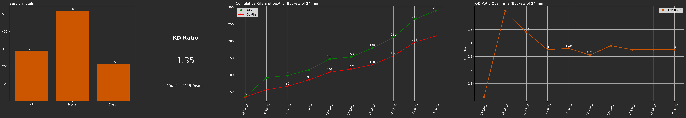

**[English](README.md) | العربية**

## **NiceShot AI: طبقة التحليلات التي لا تضيفها الألعاب**

- **أداة خفيفة**
- **تعمل محليًا على جهازك**
- **بدون طوابير معالجة سحابية**
- **بدون إنشاء حساب**
- **تحليل وتدريب غير محدود لساعات اللعب**
- **ملفات اللعب الخاصة بك تبقى على جهازك**
- **تثبيت سهل**

---

**NiceShot AI** هو أداة مفتوحة المصدر مبنية بلغة Python لتحليل فيديوهات اللعب باستخدام **الرؤية الحاسوبية (Computer Vision)** ونماذج **Vision-Language Models (VLMs)** و**Large Language Models (LLMs)**.

يستطيع NiceShot AI تلقائيًا:

- اكتشاف وتتبع أحداث اللعب المهمة
- إنشاء مقاطع فيديو للأحداث المكتشفة
- إنشاء فيديوهات Highlights وتجميعات لأفضل اللحظات
- إنشاء تقارير وإحصائيات عن جلسة اللعب
- تحليل الأحداث السلبية، مثل حالات الموت
- فهم المشهد من خلال تحليل الفيديو إطارًا بإطار
- تقديم اقتراحات تدريبية وتحسينات على طريقة اللعب

 

  

 

---

## الألعاب المدعومة

### Call of Duty: Black Ops 7 (2025)

الأحداث الحالية:

| الحدث | الوصف | القيود |
|---|---|---|
| Kill | حالات قتل بالأسلحة | يتم اكتشاف القتل في المواجهات المباشرة حاليًا |
| Medal | ظهور ميدالية أثناء اللعب | يتم حساب عدد الميداليات فقط، وليس نوعها |
| Death | موت اللاعب أثناء اللعب | — |

### Call of Duty: Black Ops 6 (2024)

| الحدث | الوصف | القيود |
|---|---|---|
| Kill | حالات قتل بالأسلحة | يتم اكتشاف القتل في المواجهات المباشرة حاليًا |
| Medal | ظهور ميدالية أثناء اللعب | يتم حساب عدد الميداليات فقط |
| Death | موت اللاعب أثناء اللعب | — |

### Call of Duty: Modern Warfare II (2022)

**لا تزال قيد الاختبار.**

| الحدث | الوصف | القيود |
|---|---|---|
| Kill | حالات قتل بالأسلحة |  |
| Death | موت اللاعب أثناء اللعب | — |

---

## النماذج المستخدمة

### Event Detector

يستخدم NiceShot نماذج:

- **YOLOv8n**
- **YOLO11n**

لاكتشاف أحداث اللعب.

تم تدريب النماذج باستخدام مجموعة بيانات مخصصة تم جمعها ووضع التعليقات التوضيحية عليها من فيديوهات لعب، وفق الترخيص الموضح في المشروع.

### Event Scene Understanding

يستخدم:

**Qwen2.5-VL-3B-Instruct**

كنموذج Vision-Language Model لتحليل مقاطع اللعب القصيرة وفهم المشهد **إطارًا بإطار** اعتمادًا على الأحداث المكتشفة والسياق البصري.

### Event Scene Coaching

يستخدم:

**Phi-3-mini-4k-Instruct**

كنموذج لغوي لتحليل الأوصاف التي ينتجها نموذج VLM.

يستخدم النموذج هذه المعلومات من أجل:

- تفسير ما حدث.
- تحديد الأخطاء أو نقاط التحسين.
- اقتراح خيارات لعب أفضل.
- تقديم نصائح تدريبية قابلة للتطبيق.

---

## أهم الميزات

### اكتشاف وتتبع الأحداث

يستطيع NiceShot التعامل مع نماذج وأحداث مختلفة من خلال إعدادات قابلة للتخصيص، مما يسمح بتكييف النظام مع ألعاب ونماذج مختلفة دون الحاجة إلى إعادة بناء النظام بالكامل.

### التحقق من الأحداث باستخدام OCR

يستخدم **EasyOCR** للمساعدة في التأكد من صحة بعض الأحداث وتجنب تسجيل أحداث خاطئة أثناء مشاهد خاصة داخل اللعبة، مثل:

- Killcams
- Spectating

### اكتشاف الأحداث المركبة

يمكن للنظام اكتشاف أحداث يتم تكوينها من عدة أحداث متتالية.

مثال:

> عدة عمليات قتل متتالية خلال فترة زمنية محددة → Kill Streak

### تسجيل الأحداث والوقت

يقوم NiceShot بتسجيل الأحداث المكتشفة مع توقيتها وحفظها في ملف CSV، مما يسمح باستخدام البيانات لاحقًا في تحليل اللعب.

### تحليل جلسة اللعب

ينشئ النظام تقريرًا يتضمن رسومًا وإحصائيات تساعد على فهم أداء اللاعب خلال جلسة اللعب.

### التحليل والتدريب باستخدام الذكاء الاصطناعي

يمكن لـ NiceShot تحليل المقاطع السلبية، مثل مقاطع الموت، باستخدام مرحلتين:

**VLM → فهم المشهد**

ثم:

**LLM → تفسير ما حدث وتقديم التدريب**

يقوم VLM بتحليل المشهد إطارًا بإطار، ثم يقوم LLM بتفسير التسلسل وتقديم اقتراحات لتحسين طريقة اللعب.

يمكن التحكم في نسبة المقاطع التي يتم تحليلها:

| الوضع | نسبة المقاطع السلبية التي يتم تحليلها |
|---|---:|
| Quick | 10% |
| Basic | 25% |
| Long | 50% |
| Full | 100% |

---

## ميزات إضافية

- **Auto-Clipping:** إنشاء مقاطع تلقائيًا للأحداث المكتشفة.
- **16:9 & TikTok:** تصدير المقاطع بتنسيقات أفقية ورأسية.
- **Highlight Compilations:** إنشاء فيديو واحد يجمع عدة مقاطع.
- **أطوال مخصصة للتجميعات:** تحديد طول فيديو الـHighlight النهائي.
- **تحليل فيديوهات متعددة:** إمكانية تحليل عدة فيديوهات من قناة Twitch.
- **ترتيب المقاطع المميزة:** ترتيب بعض المقاطع الخاصة بناءً على الأحداث التي تحتوي عليها.

---

## القيود الحالية

اكتشاف الأحداث ليس مثاليًا.

في بعض الحالات يمكن أن:

- يتم اكتشاف الحدث أكثر من مرة.
- لا يتم اكتشاف الحدث على الإطلاق.

---

## متطلبات التشغيل الدنيا التي تم اختبارها

- **نظام التشغيل:** Windows 10/11
- **GPU:** NVIDIA GTX 1650 مع 4GB VRAM
- **RAM:** 16GB
- **التخزين:** 20GB

> هذه المواصفات هي الحد الأدنى الذي تم اختباره. يعتمد الأداء الفعلي على دقة الفيديو، ومواصفات الجهاز، وعدد الأحداث الموجودة في الفيديو.

حاليًا لا يوجد دعم مختبر لـ AMD أو Intel GPUs.

---

## الأداء

تم اختبار NiceShot على جهازين:

**RTX 5070 8GB / 32GB RAM**

حتى **170 FPS** في مرحلة استدلال الإطارات عند استخدام `frames_to_skip = 5`.

**GTX 1650 4GB / 16GB RAM**

حتى **60 FPS** في نفس الاختبار.

> سرعة تحليل الـVLM/Coaching ليست ضمن هذه الأرقام.

---

**فيديو توضيحي:** [YouTube](https://youtu.be/op1GDREXiOg)

---