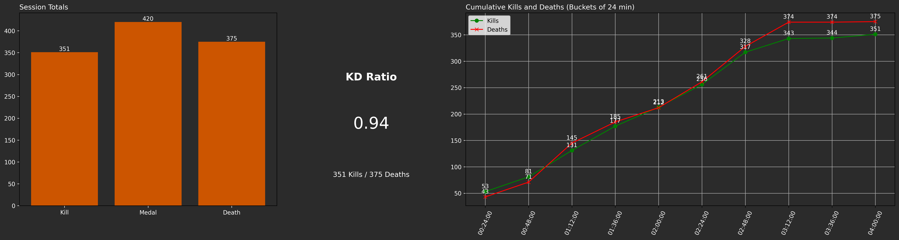

## **NiceShot_AI: Python Computer Vision Tool**

NiceShot AI is a Python tool powered by computer vision to analyze gameplay videos. With the integration of cutting-edge tools like YOLO, OpenCV, FFmpeg, and matplotlib, NiceShot AI is designed to automatically detect, track and clip key gameplay events as well as create visual report for gameplay session analysis.

Simple demo showcasing tool results: (https://youtu.be/op1GDREXiOg)

---

### **Supported Games**

- **Call of Duty: Black Ops 7 (2025) --> Still in testing**

| Key events |                        Description                            |          Limitations        |
|------------|---------------------------------------------------------------|-----------------------------
|    Kill    |  Only face to face gun kills                                  |  Only face-to-face gun kills|
|    Medal   |  When a medal earned by the player pops up during gameplay    |              -              |
|    Death   |  When player gets eliminated during gameplay                |                -              |

- **Call of Duty: Black Ops 6 (2024)**

| Key events |                        Description                            |          Limitations        |
|------------|---------------------------------------------------------------|-----------------------------
|    Kill    |  Only face to face gun kills                                  |  Only face-to-face gun kills|
|    Medal   |  When a medal earned by the player pops up during gameplay    |              -              |
|    Death   |  When player gets eliminated during gameplay                |                -              |

---

### **Model Description**

YOLOv8n by [Ultralytics](https://github.com/ultralytics/ultralytics). Fine-tuned on custom collected & annotated dataset of gameplay video under CC license.

---

### **Tool Features**

- **Robust to Scalability**: Uses configurable variables enabling it to adapt to different game models and events without massive changes. (still to be tested)
- **Accurate Event Confirmation**: Using EasyOCR to prevent counting events occurring in special game scenes (ex.KILLCAMS and SPECTATING).
- **Special Events Detection**: (Ex. Kill Streaks occurring from the combination of multiple consecutive kills within a time threshold).
- **Events Timestamping & CSV Output**: Timestamps detected events and dumps into a CSV file with 2 columns [Timestamp, Event] for further gameplay data analysis and inspections.
- **Session Analysis**: Creates a summary report consisting of multiple charts providing a post-session stats analysis.



---

### **Extra Features**

- **Event Auto-Clipping**: Clipping detected events using event's start time and end time.
- **Clips Export in 16:9 & TikTok formats**
- **Creating Highlight Reels**: Concatenating all clips within a folder into one compilation video with simple fade in & out transition edits between clips in both vertical & horizontal formats.
- **Custom Reel Lengths**: Allowing for creating compilations of any length from the extracted clips.
- **Analyzing videos in bulk from a Twitch channel**: Downloads and analyzes desired game streams from a Twitch channel performing bulk analysis of gameplay videos.
- **Ranking Special Clips**: Ex. (Hot Kill Clips where multiple medals pop up during the event).

---

### **Limitations**

- **An event may get detected more than one time or not detected at all**: From my testing, an event getting detected more than once is more likely than not getting detected at all which means more tuning should be done on the tracker algorithm.
- **Special kill events are not detected**: Model is not trained on detecting player's "grenade kill", "mine/trap kill", etc. Just face to face gun kills are counted.

---

### **Installation**

To get started with **NiceShot_AI**, download & install ffmpeg from the official website: https://www.ffmpeg.org/download.html first and add it to your PATH.

#### **Second: Install the Dependencies**
Create a Python virtual environment (optional, but recommended). My Python version is 3.10.11

```bash
python -m venv venv
venv\Scripts\activate
```

Install torch cuda. What worked for me is cuda 12.1:
```bash
pip install torch torchvision torchaudio --index-url https://download.pytorch.org/whl/cu121
```

Install dependencies:
```bash
pip install -r requirements.txt
```

---

### **Run the tool**
```
from src.niceshot_ai.detector import EventDetector

detector = EventDetector("Call of Duty Black Ops 6", # Name of the game
                        'game_models/yolov8n-cod_bo6.pt', # YOLO Model Path
                        'ffmpeg.exe', # FFMPEG Path (You can find it where you installed FFMPEG. Can also be 'ffmpeg.exe')
                        "A:/Niceshot_AI/EXTRAS/ALL_VIDEOS_FOR_INFERENCE/1.mp4", # CoD BO6 gameplay video or Twitch Channel Link
                        total_hours=1, # Total hours to analyze of the video (each video in case analyzing a Twitch Channel)
                        save_clips=False, # Save clips locally
                        add_to_csv=True, # Add events and timestamps to a CSV file.
                        output_dir='test3', # Output directory where all clips, highlights and CSV file are saved
                        frames_to_skip=8, # Frames to skip during analysis (The more, the faster the analysis is finished)
                        frame_idx_start=0, # Starting frame
                        create_montage=True, # Create a highlight reel for clipped events
                        max_workers=6, # Default for extracting clips
                        max_videos=3, # Only useful if passing a Twitch channel as it gets the most recent specified number of videos
                        montage_length_sec=50, # Total duration of the generated highlight reel in seconds
                        vertical_format=True, # Auto-clip in vertical format
                        advanced_detection=True, # Use OCR to confirm some events
                        ) 

detector.detect_events()
```

---

### **Processing Speed**

Tested on my new laptop with the following specs:
- **CPU**: core i9 14th gen
- **GPU**: RTX5070 8GB
- **RAM**: 32GB

Tested on my old laptop with the following specs:
- **CPU**: core i7 10th gen
- **GPU**: GTX1650 4GB
- **RAM**: 16GB


|    Device   | Frame Inference |
|-------------|-----------------|
| New laptop  |  Up to 170 FPS with frames_to_skip = 5|
| Old laptop  |  Up to 60 FPS with frames_to_skip = 5|


#### **Advanced Detection with OCR**

This is run only to confirm an event after it's detected. Not through the whole video frames. It can cause the processing speed to fall down from 170 FPS to 30 FPS (on new laptop) temporarily until event is confirmed. It can definitely be turned off, however this will cause a kill event during "SPECTATING" to be counted.

---