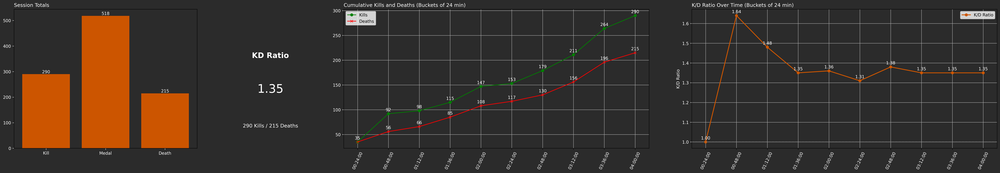

## **NiceShot_AI: Python Computer Vision Tool**

NiceShot AI is a Python tool powered by computer vision to analyze gameplay videos. With the integration of cutting-edge tools like YOLO, OpenCV, FFmpeg, and matplotlib, NiceShot AI is designed to automatically detect, track and clip key gameplay events as well as create visual report for gameplay session analysis.

Simple demo showcasing tool results: (https://youtu.be/op1GDREXiOg)

---

### **Supported Games**

- **Call of Duty: Black Ops 7 (2025) --> Still in testing**

| Key events |                        Description                            |          Limitations        |
|------------|---------------------------------------------------------------|-----------------------------
|    Kill    |  Gun kills                                  |  Only face-to-face gun kills|
|    Medal   |  When a medal earned by the player pops up during gameplay    |              Medal type not detected, only count              |
|    Death   |  When player gets eliminated during gameplay                |                -              |

- **Call of Duty: Black Ops 6 (2024)**

| Key events |                        Description                            |          Limitations        |
|------------|---------------------------------------------------------------|-----------------------------
|    Kill    |  Gun kills                                  |  Only face-to-face gun kills|
|    Medal   |  When a medal earned by the player pops up during gameplay    |              Medal type not detected, only count              |
|    Death   |  When player gets eliminated during gameplay                |                -              |

- **Call of Duty: Modern Warfare II (2022) --> Still in testing**

| Key events |                        Description                            |          Limitations        |
|------------|---------------------------------------------------------------|-----------------------------
|    Kill    |  Gun kills                                  |  -  |
|    Death   |  When player gets eliminated during gameplay                |                -              |

---

### **Model Description**

YOLOv8n by [Ultralytics](https://github.com/ultralytics/ultralytics). Fine-tuned on custom collected & annotated dataset of gameplay videos under CC license.

---

### **Tool Features**

- **Robust to Scalability**: Uses configurable variables enabling it to adapt to different game models and events without massive changes. (In testing)
- **Accurate Event Confirmation**: Using EasyOCR to prevent counting events occurring in special game scenes (ex.KILLCAMS and SPECTATING).
- **Special Events Detection**: (Ex. Kill Streaks occurring from the combination of multiple consecutive kills within a time threshold).
- **Events Timestamping & CSV Output**: Timestamps detected events and dumps into a CSV file with 2 columns [Timestamp, Event] for further gameplay data analysis and inspections.
- **Session Analysis**: Creates a summary report consisting of multiple charts providing a post-session stats analysis.



---

### **Extra Features**

- **Event Auto-Clipping**: Clipping detected events using event's start time and end time.
- **Clips Export in 16:9 & TikTok formats**
- **Creating Highlight Reels**: Concatenating all clips within a folder into one compilation video with simple fade in & out transition edits between clips in both vertical & horizontal formats.
- **Custom Reel Lengths**: Allowing for creating compilations of any length from the extracted clips.
- **Analyzing videos in bulk from a Twitch channel**: Downloads and analyzes desired game streams from a Twitch channel performing bulk analysis of gameplay videos. (In testing)
- **Ranking Special Clips**: Ex. (Hot Kill Clips where multiple medals pop up during the event).

---

### **Limitations**

- **Event detection is not perfect**: From my testing, an event can get detected more than once or not detected at all.

---

### **Installation**

To get started with **NiceShot_AI**, download & install ffmpeg from the official website: https://www.ffmpeg.org/download.html first and add it to your PATH.

#### **Second: Install the Dependencies**
Create a Python virtual environment (optional, but recommended). My Python version is 3.10.11

```bash
python -m venv venv
venv\Scripts\activate
```

Install torch cuda. I used cuda 12.1 for GTX1650 4GB. Currently, I am using nightly cuda 12.8 for RTX5070 8GB:
```bash
pip install torch torchvision torchaudio --index-url https://download.pytorch.org/whl/cu121
```

Install dependencies:
```bash
pip install -r requirements.txt
```

---

### **Run the tool**
```
from src.niceshot_ai.detector import EventDetector

detector = EventDetector(
    "Call of Duty Black Ops 6", # Game name to import proper model and chart configuration
    "video1.mp4", # Gameplay video path to analyze
    total_hours=100, # Total hours to analyze of the video
    save_clips=True, # Auto-clip events and save event clips locally (required for compilation making)
    output_dir=".", # Output folder for clips, charts and csv file
    max_workers=2, # default for auto-clipping
    frame_idx_start=0, # Start frame of the video
    frames_to_skip=8, # Frames to skip during analysis (the more, the faster tha analysis)
    add_to_csv=True, # Timestamp events and output to csv
    create_montage=True, # Create compilation of every clippable event
    montage_length_sec=50, # Length of the compilation
    max_videos=1, 
    vertical_format=False, # Auto-clip events in vertical format only
    advanced_detection=True, # Confirm some events with OCR
    session_analysis=False # Report maker
)

detector.detect_events()
```

---

### **Processing Speed**

Tested on laptop_1 with the following specs:
- **CPU**: core i9 14th gen
- **GPU**: RTX5070 8GB
- **RAM**: 32GB

Tested on laptop_2 with the following specs:
- **CPU**: core i7 10th gen
- **GPU**: GTX1650 4GB
- **RAM**: 16GB


|    Device   | Frame Inference |
|-------------|-----------------|
| laptop_1  |  Up to 170 FPS with frames_to_skip = 5|
| laptop_2  |  Up to 60 FPS with frames_to_skip = 5|


#### **Advanced Detection with OCR**

This is run only to confirm an event after it's detected. Not through the whole video frames. It can cause the processing speed to fall down from 170 FPS to 30 FPS (on new laptop) temporarily until event is confirmed. It can definitely be turned off, however this will cause a kill event during "SPECTATING" to be counted.

---